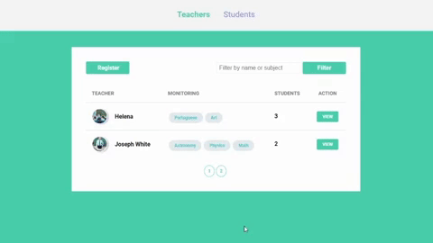
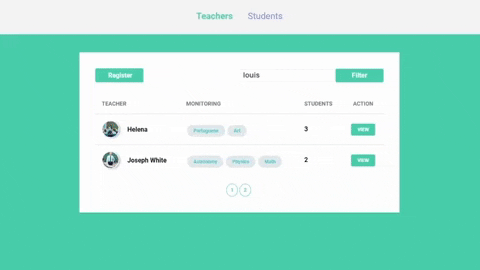
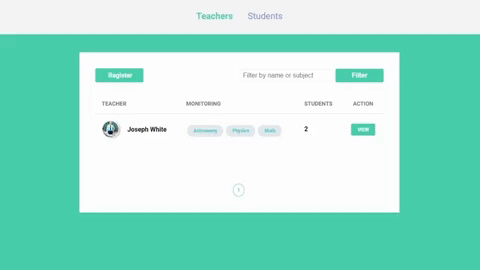

# Classrom

## 📝About

**Classroom** is a site where teacher can register themselves to give particular classes and students can look for a teacher in a specific subject.

[Demonstração](https://bit.ly/30kfAxs)

---
## 💻Technologies used 

* [HTML 5](https://www.w3schools.com/html/)         
* [CSS 3](https://www.w3.org/Style/CSS/Overview.en.html)         
* [Javascript](https://www.w3schools.com/js/js_es6.asp)
* [Express](https://expressjs.com/)
* [Nunjucks](https://mozilla.github.io/nunjucks/) 
* [Node](https://nodejs.org/en/download/)  
* [SQL](https://www.w3schools.com/sql/) & [Postgres](https://www.sqlite.org/)

---
## 🔧Functionalities 

* ### Show Users
<h1>
    
</h1>

* ### Search Users
<h1>
    
</h1>

* ### Register Users
<h1>
    
</h1>

* ### Edit and Delete Users
<h1>
    
</h1>
---

## 📂How to download the project
Esse projeto requer que seu dispositivo tenha o [Node](https://nodejs.org/en/download/) instalado.

```bash
    # Clone project
    $ git clone https://github.com/s4imu/Classrom.git
    
    # Enter into directory
    $ cd Classrom

    # Install the dependencies
    $ npm install .

    # Create the database and table in the Postgres

    # Start the project
    $ npm start
```
